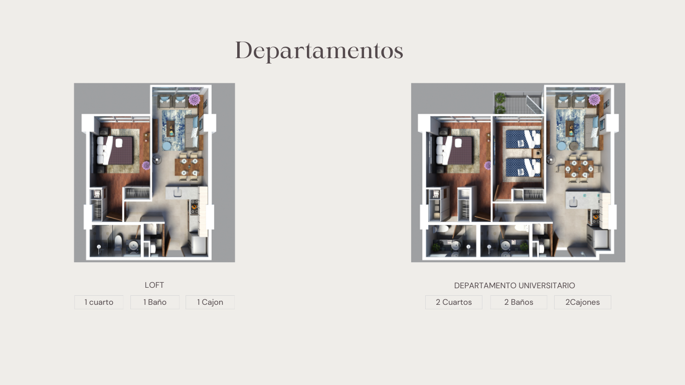
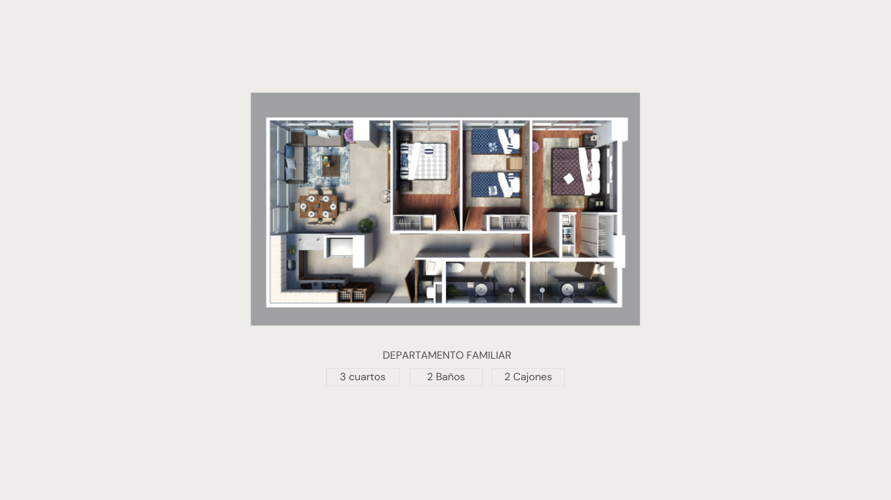
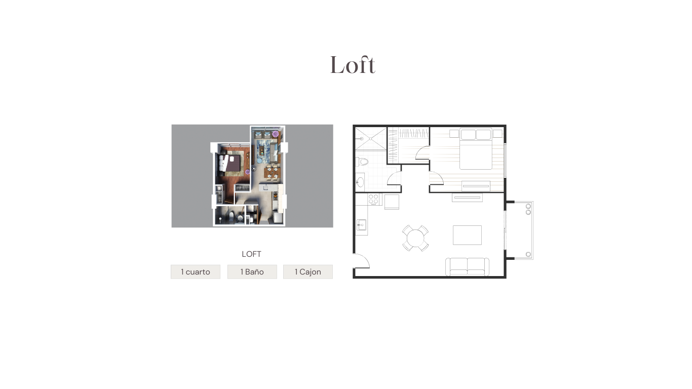
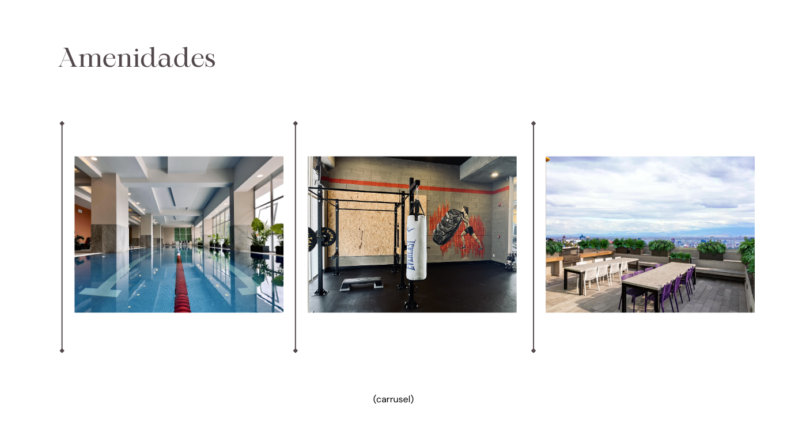
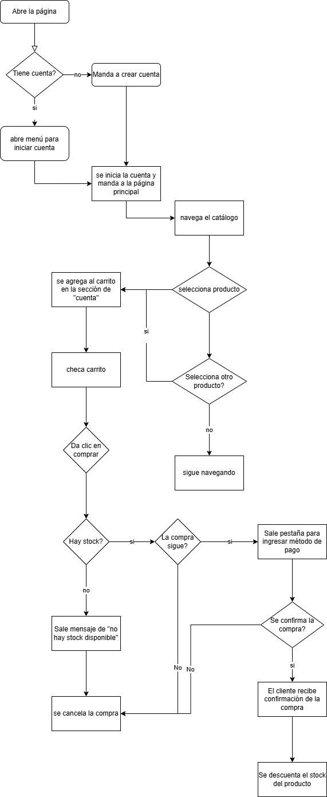

# Tienda Online: Mirez Inmobiliaria

## A. Mirez Inmobiliaria

## B. Descripción de la tienda
Mirez Inmobiliaria es una tienda online que se especializa en la promoción y venta de departamentos de lujo de 1 a 3 habitaciones, de 46 a 94 metros cuadrados, en Lomas de Tarango, CDMX.

## C. Inventario de productos

| ID | Producto        | Descripción                         | Precio | Stock | Entrega     |
|----|------------------|-------------------------------------|--------|-------|----------------|
| Vi  | Loft | Departamento de 46 metros cuadrados, una habitación, un baño, un cajón de estacionamiento    | $2'820,000.00  | 14     | Preventa   |
| Qi  | Departamento Universitario | Departamento de 69 metros cuadrados habitables mas 3 de balcón con 2 habitaciones, 2 baños y 2 cajones de estacionamiento| $4'017,500.00   | 8   | Preventa   
| X  | Departamento Familiar| Departamento de 94 metros cuadrados con 3 habitaciones, 2 baños y 2 cajones de estacionamiento| $4'890,000.00   | 3   | Entrega Inmediata            |

## D. Moodboard de diseño de la UI

## E. Algoritmo del proceso de compra (lenguaje natural)

1. El cliente ingresa al sitio web.
2. Si no tiene cuenta crea una.
3. Navega por el catálogo y selecciona los productos que desea comprar.
4. Agrega los productos al carrito de compras El cual se encuentra en la sección de su cuenta.
5. Revisa el resumen de su pedido en el carrito.
6. Hace clic en el botón de "Comprar".
7. Ingresa sus datos personales y método de pago.
8. Confirma la compra.
9. El sistema verifica el stock y el pago.
10. Si todo es correcto, se descuenta el stock y se genera la orden.
11. El cliente recibe una confirmación de compra y detalles del pedido.

## F. Diagrama de flujo del proceso de compra

## Práctica 12

- [Readme](/README.md)
